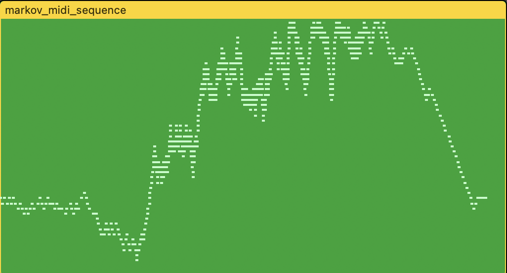
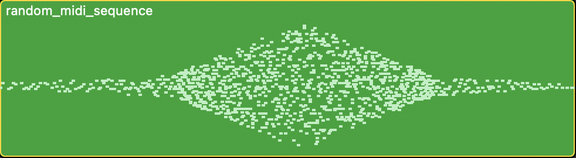

# music-project

This is a repository of various scripts I used to generate **random sequences** of notes for a music production I worked on! I used the _mido python library_ to create midi tracks conforming to certain rules; the tracks sped up and slowed down, and varied in range of notes along with its speed. There were two kinds of sequences I was looking at particularly:
* Markov chains: I created a sequence of connected notes and assigned a transition probability in each direction, which I varied to increase and decrease "randomness". Here is what that looks like, where the initial and final segments have higher probability of moving toward the starting position:

* Random series: I generated random numbers between a low and a high value. I **varied the width of the envelope with speed**, as shown below:

I then exported the out files onto a DAW and used them as a basis for my production! This repository also includes the final production output, **created in surround sound but outputted in binaural audio**.